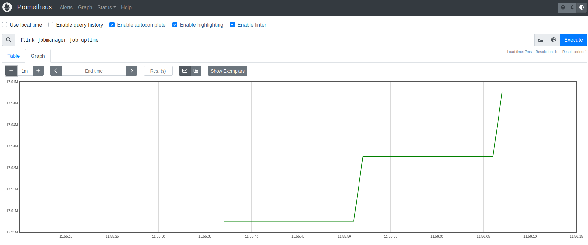

# Recommendation system use case

The sample scenario:
Orinoco Inc, retail sales company wants to display a widget on product pages of similar products that the user might be interested in buying.
They should recommend:
- Up to 6 highly rated products in the same category as that of the product the customer is currently viewing
- Only products that are in stock
- Products that the customer has bought before should be favoured
- <i>TODO: Avoid showing suggestions that have already been made in previous pageviews </i>

The data:
- Input: A clickstream (user id, product id, event time)
- Input: A stream of purchases (user id, product id, purchase date)
- Input: An inventory of products (product id, product name, product category, number in stock, rating)

Output: A stream of recommendations (user id, 6 product ids)

## Running the application

### Prerequisite:
The steps in the [README.md](../README.md) required to be completed for setting up:
- Kafka cluster
- Flink Kubernetes Operator
- Apicurio Registry
- SqlRunner image
- DataGenerator image

### Deploying Flink cluster for recommendation app
1. Apply the `data-generator` Kubernetes Deployment:
    ```
    kubectl apply -f recommendation-app/data-generator.yaml -n flink
    ```
   It continuously produces sample data to `flink.sales.records` and `flink.click.streams`.
2. Create a ConfigMap that holds product inventory data in CSV format. 
    ```
    kubectl create configmap product-inventory --from-file recommendation-app/productInventory.csv -n flink
    ```
   The ConfigMap will be volume mounted to the recommendation-app pods.
3. Apply the FlinkDeployment for the recommendation-app:
    ```
    kubectl apply -f recommendation-app/flink-deployment.yaml -n flink
    ```
4. In a separate tab, `exec` into the kafka pod and run the console consumer:
    ```
    kubectl exec -it my-cluster-dual-role-0 -n flink -- /bin/bash \
    ./bin/kafka-console-consumer.sh --bootstrap-server localhost:9092 --topic flink.recommended.products --from-beginning
    ```
5. You should see messages such as the following:
   ```
    user-27,"140,13,137,95,39,138","2024-06-28 13:01:55"
    user-14,"40,146,74,81,37,19","2024-06-28 13:01:55"
    user-36,"42,106,82,153,158,85","2024-06-28 13:02:00"
    user-5,"83,123,77,41,193,136","2024-06-28 13:02:00"
    user-27,"55,77,168","2024-06-28 13:02:05"
    user-44,"140,95,166,134,199,180","2024-06-28 13:02:10"
    user-15,"26,171,1,190,87,32","2024-06-28 13:02:10"
   ```
The expected format of the result is `userId`, `comma separated 6 product ids` and `timestamp` of the window.

You can also deploy Prometheus to monitor the metrics inside job manager and task manager.
5. Update the prometheus configuration with the ip address of flink pods to scrape from:
   ```
   sed -i s/JOB_MANAGER/$(kubectl get pods -lapp=recommendation-app -o=jsonpath="{range .items[*]}{.status.podIP}{','}{end}" | cut -d ',' -f1)/g recommendation-app/prometheus-install/prometheus-config.yaml
   sed -i s/TASK_MANAGER/$(kubectl get pods -lapp=recommendation-app -o=jsonpath="{range .items[*]}{.status.podIP}{','}{end}" | cut -d ',' -f2)/g recommendation-app/prometheus-install/prometheus-config.yaml
   ```

6. Install prometheus, configuration, and service:
   ```
   kubectl apply -f recommendation-app/prometheus-install -n flink
   ```

7. Expose the prometheus UI with port-forward rule:
   ```
   kubectl port-forward svc/prometheus-service 9090
   ```
8. Now you can monitor the metrics in job manager or task manager via the prometheus UI is accessible at localhost:9090.



       
